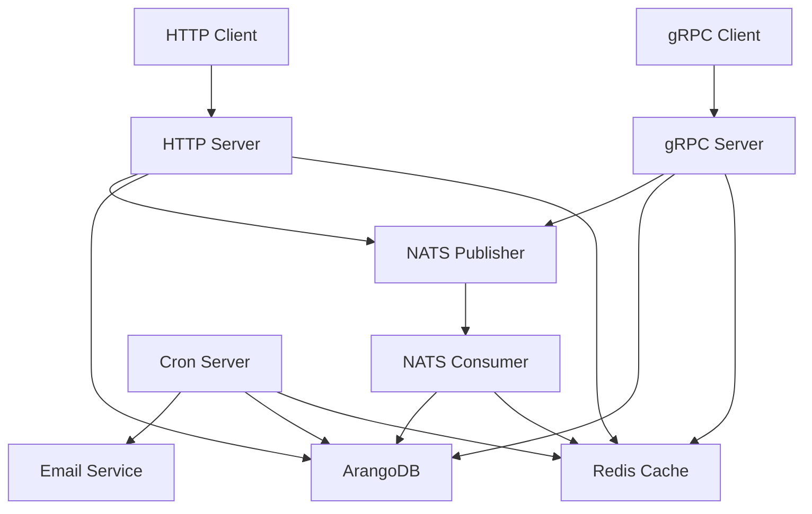

# Activity Log Microservice - Separated Architecture

## Overview

This activity log microservice has been refactored into **4 separate, independently deployable services**:

1. **HTTP Server** (`cmd/http-server/`) - REST API with Echo framework and Swagger documentation
2. **gRPC Server** (`cmd/grpc-server/`) - gRPC API for high-performance communication
3. **NATS Consumer** (`cmd/consumer/`) - Message queue consumer for async processing
4. **Cron Server** (`cmd/cron-server/`) - Scheduled tasks for maintenance and notifications

## Architecture Benefits

### ✅ **Microservice Advantages**
- **Independent Scaling**: Scale each service based on demand
- **Independent Deployment**: Deploy services individually without affecting others
- **Technology Diversity**: Each service can use different technologies as needed
- **Fault Isolation**: Issues in one service don't affect others
- **Team Ownership**: Different teams can own different services

### ✅ **Service Separation**
- **HTTP Server**: Handles web requests, API documentation, user-facing operations
- **gRPC Server**: High-performance internal communication, service-to-service calls
- **NATS Consumer**: Async message processing, event handling, background operations
- **Cron Server**: Scheduled maintenance, cleanup, reporting, email notifications

## Quick Start

### 1. Start All Services with Docker Compose
```bash
# Build and start all services
make up-build

# Or start with existing images
make up
```

### 2. Start Individual Services for Development
```bash
# Start infrastructure services only
make dev

# Run individual services locally
make run-http      # HTTP server on :8080
make run-grpc      # gRPC server on :9000
make run-consumer  # NATS consumer
make run-cron      # Cron server
```

### 3. Build Individual Services
```bash
# Build all services
make build-all

# Build individual services
make build-http
make build-grpc
make build-consumer
make build-cron
```

## Service Details

### 🌐 **HTTP Server** (Port 8080)

**Purpose**: REST API, Swagger documentation, web interface

**Features**:
- Echo framework with middleware
- Swagger/OpenAPI documentation
- Request validation and error handling
- Health checks and metrics (port 2113)

**Endpoints**:
- `GET /health` - Health check
- `POST /api/v1/activity-logs` - Create activity log
- `GET /api/v1/activity-logs/:id` - Get activity log
- `GET /api/v1/activity-logs` - List activity logs
- `GET /docs/*` - Swagger UI
- `GET /metrics` - Prometheus metrics

**Run Standalone**:
```bash
make run-http
# or
CONFIG_PATH=configs/config.yaml go run ./cmd/http-server
```

### 📡 **gRPC Server** (Port 9000)

**Purpose**: High-performance internal API, service-to-service communication

**Features**:
- Protocol Buffers for efficient serialization
- gRPC health checks
- Load balancing support
- Metrics (port 2112)

**Services**:
- `ActivityLogService.CreateActivityLog`
- `ActivityLogService.GetActivityLog` 
- `ActivityLogService.ListActivityLogs`

**Run Standalone**:
```bash
make run-grpc
# or
CONFIG_PATH=configs/config.yaml go run ./cmd/grpc-server
```

### 📨 **NATS Consumer** (Port 2114 for metrics)

**Purpose**: Async message processing, event handling

**Features**:
- NATS JetStream consumer
- Message acknowledgment and retry
- Dead letter queue handling
- Metrics (port 2114)

**Processes**:
- Activity log creation events
- Email notification triggers
- Cache invalidation events

**Run Standalone**:
```bash
make run-consumer
# or
CONFIG_PATH=configs/config.yaml go run ./cmd/consumer
```

### ⏰ **Cron Server** (Port 2115 for metrics)

**Purpose**: Scheduled tasks, maintenance, notifications

**Features**:
- Cron-based scheduling
- Redis cache cleanup
- Daily summary emails
- Database maintenance
- Metrics (port 2115)

**Scheduled Jobs**:
- Cache cleanup every 5 minutes
- Metrics collection every hour
- Database maintenance daily at 2 AM
- Log rotation daily at 3 AM  
- Daily summary emails at 8 AM

**Run Standalone**:
```bash
make run-cron
# or
CONFIG_PATH=configs/config.yaml go run ./cmd/cron-server
```

## Service Communication

### 🔄 **Inter-Service Communication**



### 📊 **Service Dependencies**

| Service | Required | Optional |
|---------|----------|----------|
| HTTP Server | ArangoDB, NATS | Redis, Email |
| gRPC Server | ArangoDB, NATS | Redis, Email |
| NATS Consumer | ArangoDB, NATS | Redis |
| Cron Server | ArangoDB, Redis | Email |

## Configuration

### 🔧 **Environment-Specific Configs**

**Local Development**: `configs/config.yaml`
```yaml
arango:
  url: "http://localhost:8529"
nats:
  url: "nats://localhost:4222"
redis:
  address: "localhost:6379"
email:
  host: "localhost"
```

**Docker Deployment**: `configs/config.docker.yaml`
```yaml
arango:
  url: "http://arangodb:8529"
nats:
  url: "nats://nats:4222"
redis:
  address: "redis:6379"
email:
  host: "mailhog"
```

## Deployment Options

### 🐳 **Docker Compose (Development)**

```bash
# Start all services
docker-compose up -d

# Scale HTTP servers
docker-compose up -d --scale activity-log-http=3

# View logs
docker-compose logs -f activity-log-http
```

### ☸️ **Kubernetes (Production)**

Each service has its own Dockerfile for container deployment:
- `Dockerfile.http` - HTTP server image
- `Dockerfile.grpc` - gRPC server image  
- `Dockerfile.consumer` - Consumer image
- `Dockerfile.cron` - Cron server image

```bash
# Build individual images
make docker-build-all

# Or build specific service
make docker-build-http
```

### 📈 **Service Mesh Integration**

Services are designed to work with service mesh solutions like Istio:
- Each service exposes metrics on separate ports
- Health checks are implemented
- Distributed tracing with Jaeger
- Load balancing ready

## Monitoring & Observability

### 📊 **Metrics Endpoints**

| Service | Metrics Port | Endpoint |
|---------|-------------|----------|
| HTTP Server | 2113 | `http://localhost:2113/metrics` |
| gRPC Server | 2112 | `http://localhost:2112/metrics` |
| NATS Consumer | 2114 | `http://localhost:2114/metrics` |
| Cron Server | 2115 | `http://localhost:2115/metrics` |

### 🔍 **Health Checks**

```bash
# Check all services
make health

# Individual health checks
curl http://localhost:8080/health                    # HTTP
grpcurl -plaintext localhost:9000 grpc.health.v1.Health/Check  # gRPC
curl http://localhost:2114/metrics                  # Consumer metrics
curl http://localhost:2115/metrics                  # Cron metrics
```

### 📈 **Prometheus Configuration**

Update `configs/prometheus.yml` to scrape all service metrics:
```yaml
scrape_configs:
  - job_name: 'activity-log-http'
    static_configs:
      - targets: ['activity-log-http:2113']
  - job_name: 'activity-log-grpc'
    static_configs:
      - targets: ['activity-log-grpc:2112']
  - job_name: 'activity-log-consumer'
    static_configs:
      - targets: ['activity-log-consumer:2114']
  - job_name: 'activity-log-cron'
    static_configs:
      - targets: ['activity-log-cron:2115']
```

## Development Workflow

### 🛠️ **Local Development**

1. **Start Infrastructure**:
   ```bash
   make dev  # Starts ArangoDB, NATS, Redis, etc.
   ```

2. **Run Individual Services**:
   ```bash
   # Terminal 1
   make run-http
   
   # Terminal 2  
   make run-grpc
   
   # Terminal 3
   make run-consumer
   
   # Terminal 4
   make run-cron
   ```

3. **Test Services**:
   ```bash
   make test              # Run all tests
   make health            # Check service health
   ```

### 🔄 **CI/CD Pipeline**

Each service can be built and deployed independently:

```bash
# Build and test individual services
make build-http && make test
make build-grpc && make test
make build-consumer && make test
make build-cron && make test

# Deploy individual services
docker build -f Dockerfile.http -t activity-log-http:v1.2.3 .
kubectl set image deployment/activity-log-http app=activity-log-http:v1.2.3
```

## Service Management

### 🔧 **Service Operations**

```bash
# Restart individual services
make restart-http
make restart-grpc
make restart-consumer
make restart-cron

# Scale services
make scale-http REPLICAS=5

# View service logs
make logs-http
make logs-grpc
make logs-consumer
make logs-cron
```

### 📊 **Service Status**

| Service | Status | URL | Purpose |
|---------|--------|-----|---------|
| HTTP | ✅ Running | http://localhost:8080 | REST API |
| gRPC | ✅ Running | localhost:9000 | Internal API |
| Consumer | ✅ Running | - | Message Processing |
| Cron | ✅ Running | - | Scheduled Tasks |
| Nginx | ✅ Running | http://localhost:80 | Load Balancer |

## Migration from Monolith

The original `cmd/server/main.go` has been split into:
- **HTTP logic** → `cmd/http-server/main.go`
- **gRPC logic** → `cmd/grpc-server/main.go`  
- **Consumer logic** → `cmd/consumer/main.go`
- **Cron logic** → `cmd/cron-server/main.go`

Each service maintains the same functionality but with focused responsibilities and independent scaling capabilities.

## Support & Documentation

- **API Documentation**: http://localhost:8080/docs (Swagger UI)
- **Health Checks**: `make health`
- **Service Logs**: `make logs-{service}`
- **Help**: `make help`

The separated architecture provides better scalability, maintainability, and deployment flexibility while maintaining all the original functionality.