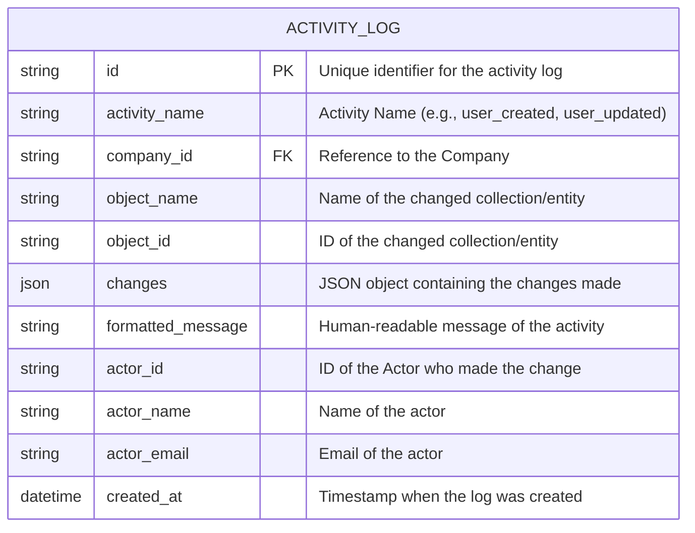

# Entity Relationship Diagram (ERD)

## Activity Log Service ERD



### Value Objects

1. **ActivityLogID**
   - Unique identifier for activity logs
   - Generated using UUID or custom algorithm

2. **ActorInfo** (embedded in ActivityLog)
   - ID, Name, Email of the actor
   - Snapshot at the time of the activity

3. **ChangeSet**
   - JSON representation of what changed
   - Can include before/after values
   - Structured data for analysis

### Business Rules

1. **Activity Log Creation**
   - Must have a valid company_id
   - Must have a valid actor
   - Object must exist at the time of logging
   - Changes must be valid JSON

2. **Data Retention**
   - Activity logs are immutable
   - Retention period defined by company policy
   - Automatic archival after retention period

3. **Access Control**
   - Users can only access logs from their company
   - Admin users can access all logs within their company
   - System logs are accessible by super admins

## Storage Strategy

### ArangoDB Collections

```
activity_logs/
├── activity_log          # Main collection for activity logs
├── companies            # Company master data
├── actors              # Actor master data
└── object_types        # Object type definitions
```

### JSON File Structure

```json
{
  "id": "550e8400e29b41d4a716446655440000",
  "activity_name": "user_created",
  "company_id": "company_123",
  "object_name": "user",
  "object_id": "user_456",
  "changes": {
    "name": "John Doe",
    "email": "john.doe@example.com",
    "role": "admin"
  },
  "formatted_message": "User John Doe was created with admin role",
  "actor": {
    "id": "admin_789",
    "name": "System Administrator",
    "email": "admin@company123.com"
  },
  "created_at": "2023-12-07T10:30:00Z"
}
```

## Indexing Strategy

### ArangoDB Indexes

1. **Primary Indexes**
   - `activity_log._key` (primary key)
   - `companies._key` (primary key)
   - `actors._key` (primary key)

2. **Secondary Indexes**
   - `activity_log.company_id` (hash index for tenant isolation)
   - `activity_log.created_at` (skiplist for time-range queries)
   - `activity_log.object_name + object_id` (compound index for object tracking)
   - `activity_log.actor_id` (hash index for actor queries)
   - `actors.email` (unique hash index)

3. **Full-Text Indexes**
   - `activity_log.formatted_message` (for search functionality)
   - `activity_log.changes` (for change content search)

## Scalability Considerations

1. **Partitioning Strategy**
   - Partition by company_id for multi-tenancy
   - Time-based partitioning for historical data

2. **Archival Strategy**
   - Move old logs to cold storage
   - Maintain summary/aggregated data
   - Compress archived data

3. **Performance Optimization**
   - Use appropriate indexes for query patterns
   - Implement caching for frequently accessed data
   - Use read replicas for reporting queries