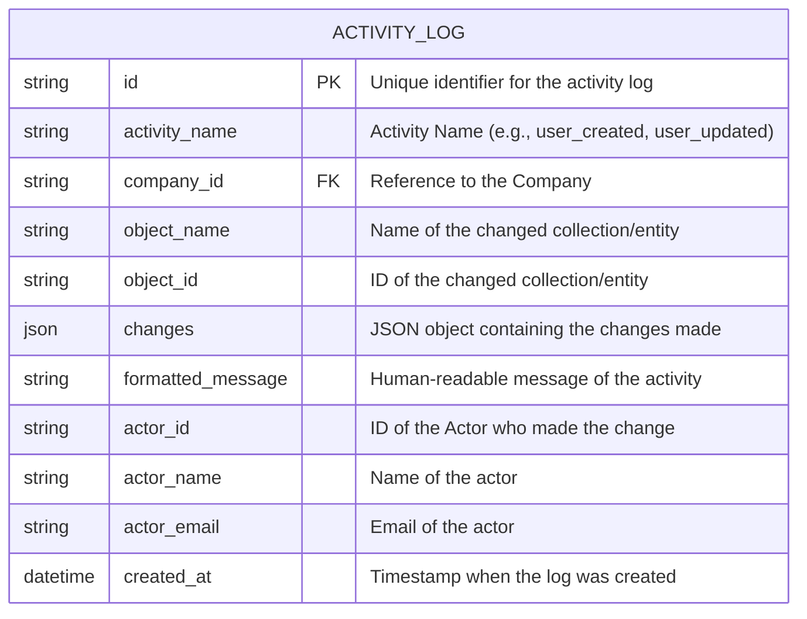

# Entity Relationship Diagram (ERD)

## Activity Log Service ERD

```mermaid
erDiagram
    ACTIVITY_LOG {
        string id PK "Unique identifier for the activity log"
        string activity_name "Activity Name (e.g., user_created, user_updated)"
        string company_id FK "Reference to the Company"
        string object_name "Name of the changed collection/entity"
        string object_id "ID of the changed collection/entity"
        json changes "JSON object containing the changes made"
        string formatted_message "Human-readable message of the activity"
        string actor_id "ID of the Actor who made the change"
        string actor_name "Name of the actor"
        string actor_email "Email of the actor"
        datetime created_at "Timestamp when the log was created"
    }

```
