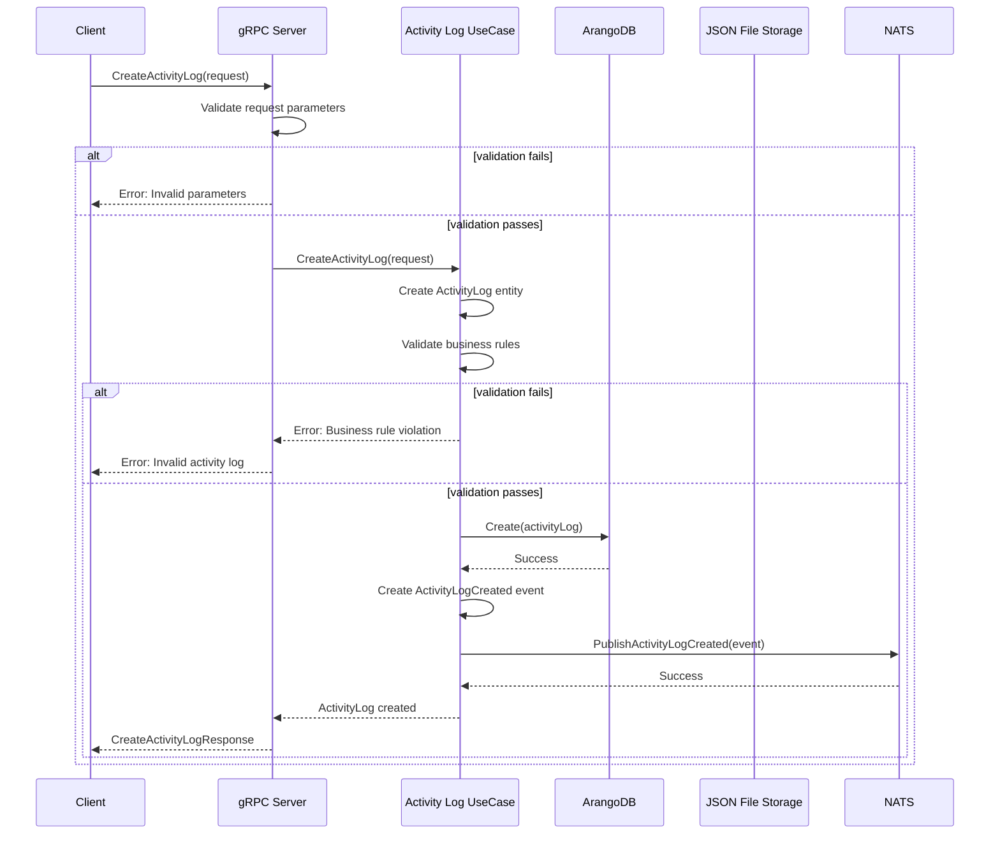
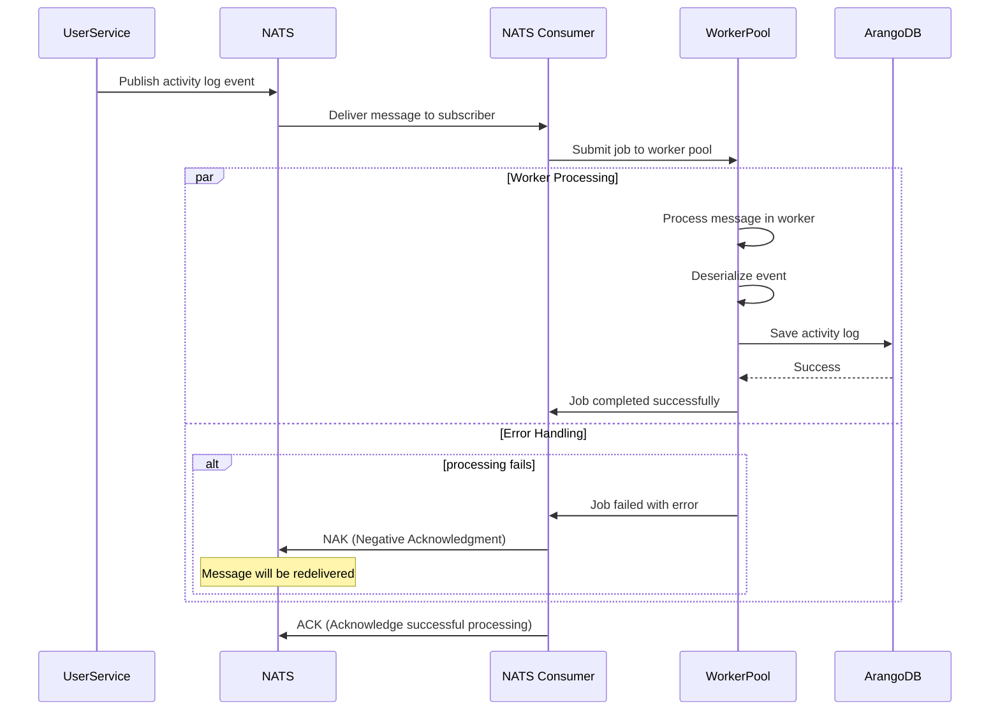
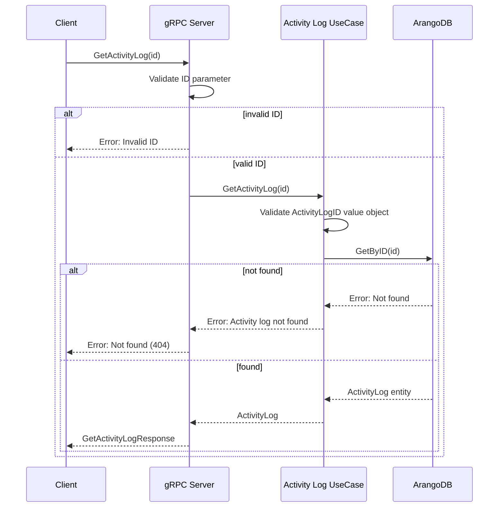
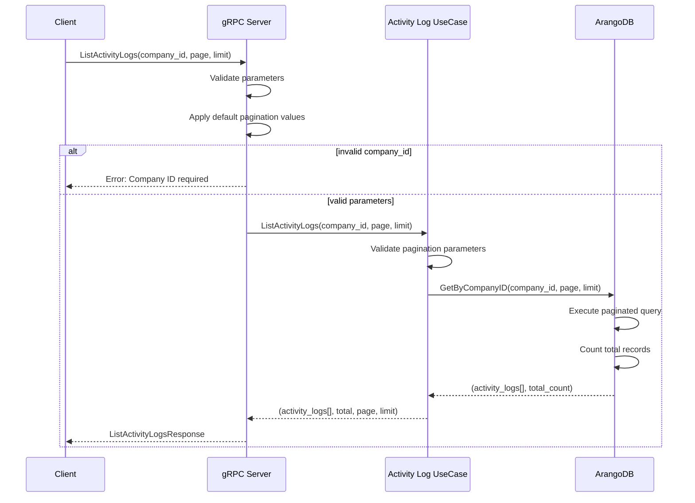
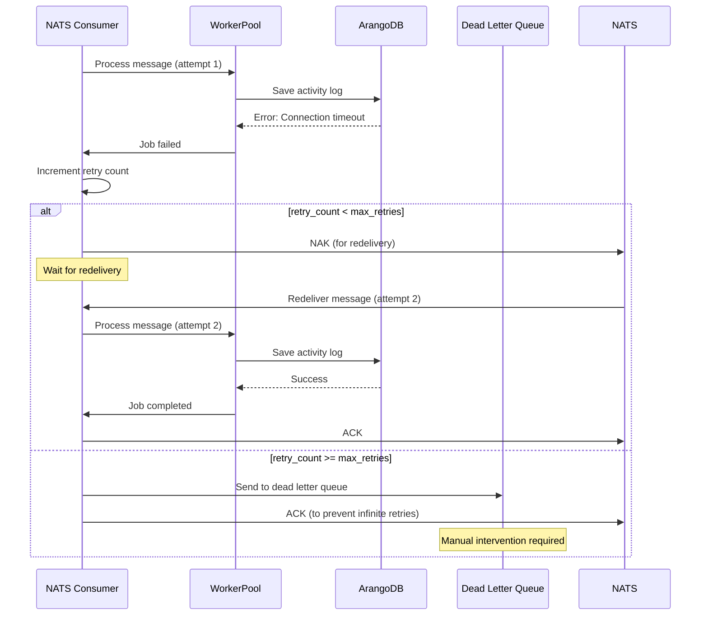
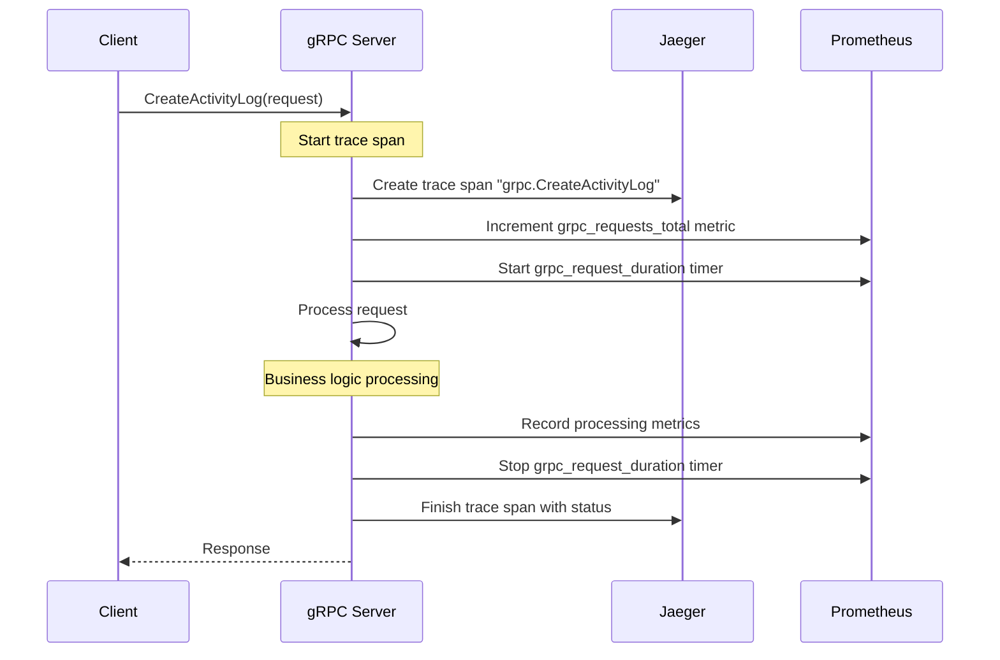
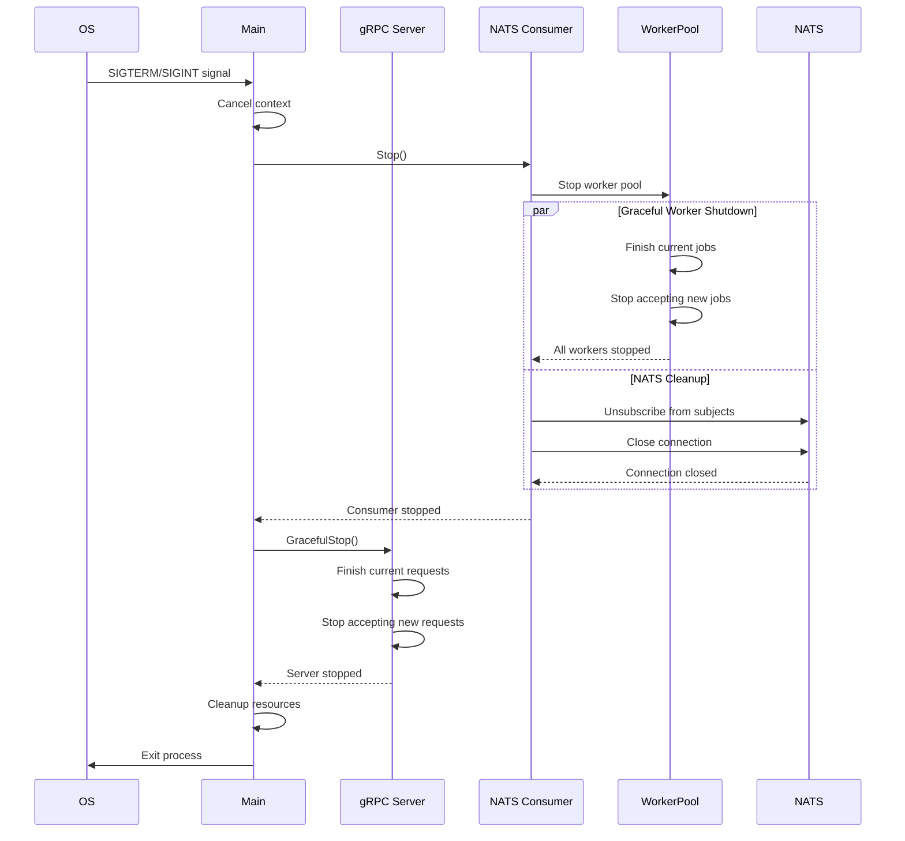

# Sequence Diagrams

## Activity Log Service Sequence Diagrams

### 1. Create Activity Log via gRPC

### 2. Event-Driven Activity Log Processing

### 3. Get Activity Log by ID

### 4. List Activity Logs with Pagination

### 5. Error Handling and Retry Logic

### 6. Monitoring and Tracing Flow

### 7. Graceful Shutdown Process

## Flow Descriptions

### 1. **Synchronous gRPC Flow**
- Client makes direct gRPC calls to the service
- Immediate validation and response
- Data is stored in both ArangoDB and JSON files
- Events are published to NATS for further processing

### 2. **Asynchronous Event Processing**
- External services publish events to NATS
- Consumer picks up messages and processes them via worker pool
- Provides better throughput and resilience
- Failed messages are retried with exponential backoff

### 3. **Data Consistency**
- Primary storage in ArangoDB for queries  
- Event sourcing pattern for audit trail
- Strong consistency with single storage system

### 4. **Error Handling Strategy**
- Validation errors return immediately to client
- Infrastructure errors trigger retry logic
- Dead letter queue for failed messages
- Comprehensive logging and monitoring

### 5. **Observability**
- Distributed tracing with Jaeger
- Metrics collection with Prometheus
- Structured logging throughout the flow
- Health checks and monitoring endpoints